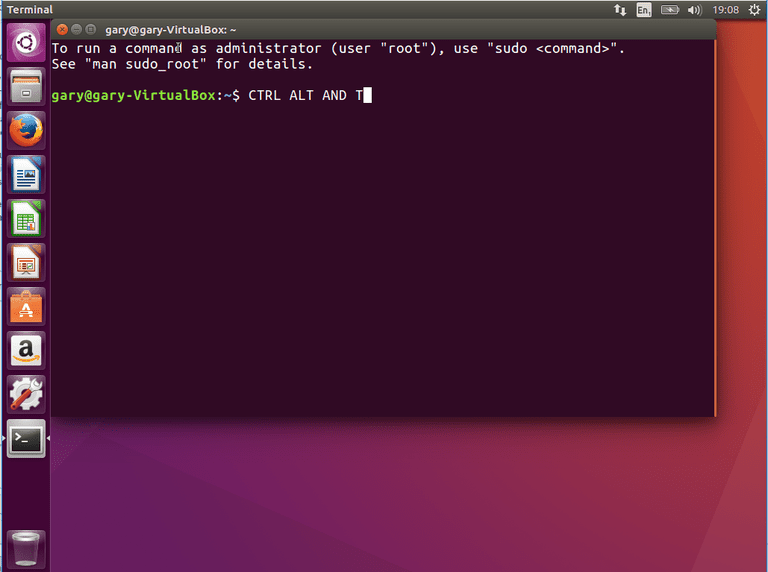
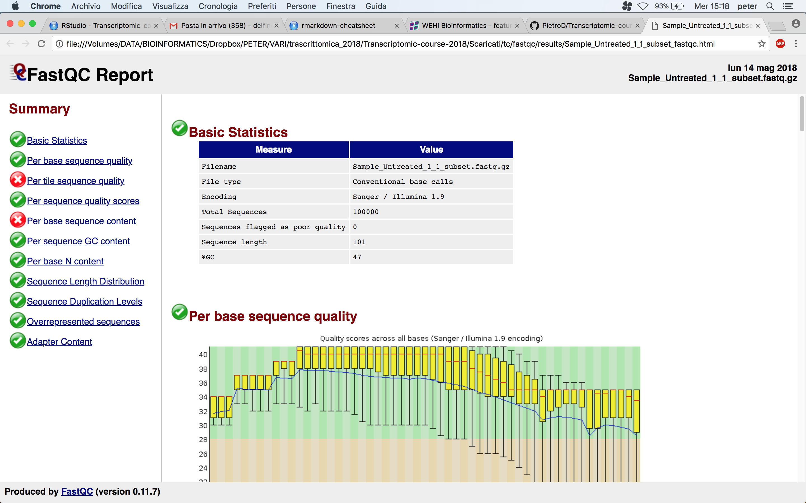

```{r setup, include=FALSE}
knitr::opts_chunk$set(echo = TRUE)
```

Accendere il computer e aprire il terminale



Spostarsi nella cartella `Scaricati`, create una nuova cartella chiamandola `tc`

```{r, engine = 'bash', eval = F}
cd Scaricati/

mkdir tc
```

Entrare nella cartella appena creata e valutarne il contenuto della cartella digitare il seguente comando

```{r, engine = 'bash', eval = T}
cd Scaricati/tc/

ls -lrth
```

La cartella dovrebbe essere vuota. Come prima cosa dobbiamo recuperare i file grezzi (FASTQ) del nostro esperimento. Per recuperare i file ci connettiamo al nostro server di laboratorio e con il protocollo di trasferimento **ssh** copiamo in locale (la cartella dove siamo in questo momento) i 2 file corrispondenti alle reads forward e alle reads reverse. Lavoreremo con un solo campione, ma come sapete l'esperimento consiste di 3 repliche biologiche per i non trattati e 3 repliche biologiche per quelli trattati. I comandi che qui eseguiremo possono essere ripetuti su più file contemporaneamente tramite appositi comandi come i cicli `for`

```{r, engine = 'bash', eval = F}
# prima scarichiamo il primo file (attenzione al punto in fondo al comando, indica current directory)
scp trascrittomica@157.27.231.104:/home/trascrittomica/Scaricati/Sample_Untreated_1_1_subset.fastq.gz .
# inserire la password quando ce la chiede (trascrittomica2017)

# controlliamo che sia stato scaricato
ls -lrth
# ora scarichiamo il secondo file
scp trascrittomica@157.27.231.104:/home/trascrittomica/Scaricati/Sample_Untreated_1_2_subset.fastq.gz .
# inserire nuovamente la password
# controlliamo
ls -lrth
```

Come potete osservare la dimensione di questi file è molto bassa rispetto alla dimensione tipica di un file che risulta da un esperimento di sequenziamento come lo abbiamo descritto. Questo perché i file originali sono stati copiati e ridotti in dimensioni con lo scopo di riuscire a manipolarli e lavorarci nei tempi della lezione, principalmente per il fatto che le capacità dei computer che stiamo usando potrebbero essere limitate e quindi non in grado di eleaborare questi file in tempi brevi

Iniziamo con esplorare questi file

```{r, engine = 'bash', eval = F}
# "apriamo" il file
less -S Sample_Untreated_1_1_subset.fastq.gz
# contiamo il numero di reads
zcat Sample_Untreated_1_1_subset.fastq.gz | echo $((`wc -l`/4))
zcat Sample_Untreated_1_2_subset.fastq.gz | echo $((`wc -l`/4))
# il numero di reads F e R coincide?
```

Per effettuare il controllo di qualità sulle nostre reads utilizzeremo il programma **FastQC** (http://www.bioinformatics.babraham.ac.uk/projects/fastqc/). Questo software (scritto in Java) prende come input un numero a piacimento di reads e calcola varie statistiche che possono dare un'idea della qualità dei nostri dati

```{r, engine = 'bash', eval = F}
# creiamo una nuova cartella dove scaricheremo il programma e salveremo i risultati
mkdir fastqc
cd fastqc/
# scarichiamo il programma con il comando wget
wget http://www.bioinformatics.babraham.ac.uk/projects/fastqc/fastqc_v0.11.7.zip
# scompattiamo la cartella
unzip fastqc_v0.11.7.zip
# rimuoviamo cartella compressa
rm fastqc_v0.11.7.zip
# vediamo cosa c'è dentro la cartella senza spostarci dentro (percorso relativo alla nostra posizione)
ls -lrth FastQC/
# il file che ci interessa, cioè il programma che andremo a richiamare è "fastqc"
# dobbiamo prima renderlo eseguibile
chmod 755 fastqc
# controlliamo che funzioni
./fastcq -h
```

A questo punto possiamo lanciare il programma dando come input i due file con le reads F e R. Il comando è molto semplice, basta specificare i nomi dei file che vogliamo controllare, e la cartella dove vogliamo che vengano salvati i report coi risultati (la cartella deve già esistere quindi prima la creiamo)

```{r, engine = 'bash', eval = F}
# torniamo indietro alla cartella fastqc e creiamo cartella per salvare i risultati
cd ..
mkdir results
# ci spostiamo una cartella su, dove stanno i nostri file
cd ..
# eseguiamo il programma (dobbiamo specificare il percorso dell'eseguibile rispetto a dove siamo) e specifichiamo inoltre il percorso della cartella di output
./fastqc/FastQC/fastqc Sample_Untreated_1_1_subset.fastq.gz Sample_Untreated_1_2_subset.fastq.gz -o fastqc/results/
```

Per ogni file di input vengono creati 2 file di output, un file html e una cartella compressa. Andiamo ad esplorare il report in formato html aprendolo con Firefox



A questo punto commentiamo insieme i risultati del controllo qualità confrontandoci con qualità di riferimento sul sito di FastQC e con la spiegazione dei moduli di analisi (https://www.bioinformatics.babraham.ac.uk/projects/fastqc/Help/3%20Analysis%20Modules/)


